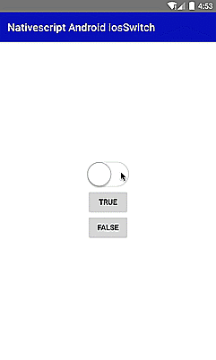

[](https://www.npmjs.com/package/nativescript-number-progressbar)
[](https://www.npmjs.com/package/nativescript-number-progressbar)
[](https://www.npmjs.com/package/nativescript-number-progressbar)

# Nativescript-Android-iOSSwitch 
A lightweight iOS switch view style for Android.Feedbacks and PRs are most Welcome.

## Demo


 | 
---------- | 
 | 

#### Native Libraries: 
Android | 
---------- | 
[luongvo/iOS-SwitchView](https://github.com/luongvo/iOS-SwitchView) 

## Installation
From your command prompt/termial go to your app's root folder and execute:

`npm i nativescript-android-iosswitch --save`

## Usage
#### XML:
```XML
<Page 
    xmlns="http://schemas.nativescript.org/tns.xsd" 
    xmlns:AndroidIosSwitch="nativescript-android-iosswitch" loaded="pageLoaded"> 
    <Page.actionBar>
      <ActionBar title="Nativescript Android iosSwitch" />
  </Page.actionBar>
  <StackLayout height="150" width="80">
   
      <AndroidIosSwitch:AndroidIosSwitch id="sb" color="red"/>
      
       <Button text="True"  tap="{{ onTrue }}" />
       <Button text="false"  tap="{{ onFalse}}" />
      
        
  </StackLayout>
</Page>

```

### TS:
```TS
import {AndroidIosSwitch} from 'nativescript-android-iosswitch';
private npb: AndroidIosSwitch;
  constructor(mainPage: Page) {
    super();
    this.npb = <AndroidIosSwitch>mainPage.getViewById('sb');

  }
     public onTrue() {
        this.npb.toggleSwitch(true);
    }
  public onFalse() {
        this.npb.setChecked(false);
    }

```


## Methods

**isChecked()**

/**
  * @return the state of switch view
  */
  
**setChecked(boolean)**

/**
  * if set true , the state change to on;
  * if set false, the state change to off
  * @param isChecked
  */
     
**toggleSwitch(boolean)**

/**
  * if set true , the state change to on;
  * if set false, the state change to off
  * <br><b>change state with animation</b>
  * @param isChecked
  */


